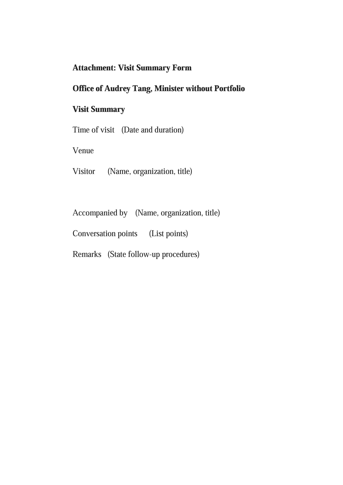

# Principles for Handling Official Visits to Digital Minister, Audrey Tang

[（中文版）](README.zh-tw.md)

## I.	Applicability

The following protocol applies to any person who visits the Digital Minister, Audrey Tang where the purpose of, or remarks made during such visit may involve the visitor’s interests, or the interests of third parties (Reference: Act on Recusal of Public Servants Due to Conflict of Interest, Article 4).

This protocol shall _not_ apply to civil servants, elected public officials, or personnel who are foreign nationals stationed in the Republic of China (Taiwan) by a foreign consular, embassy, or other organization on an official visit for business or courtesy purposes.

## II. Accompanying parties to the visitor

At least one staff to the Minister shall accompany and receive any official visitor(s) for which this protocol applies (hereinafter as “visit”); when necessary, executive officers from relevant departments of the Executive Yuan, relevant ministries or agencies, may also be invited to accompany guest(s).

## III. Visit & meeting records

1.  A record shall be made of the visit, in its entirety, recorded as an electronic sound or audio-visual file; when required, a verbatim transcript of the visit, in whole or in part, may also be made. In principle, a sound recording shall be made for any visit conducted using Executive Yuan or Minister's office space; an audio-visual recording shall be made of any visit conducted at the Minister’s official residence.

2. At least one of the three records referred to in the preceding clause (i.e. sound recording, audio-visual recording, or verbatim transcript) [shall be made public](https://track.pdis.tw); 10 days after the visit, attendees will be provided with a verbatim transcript to make corrections, or delete information that is, by law, confidential, prior to the transcript being made public.

3. Before a meeting begins, visitors shall be notified of the sound, audio-visual, or verbatim transcript record requirements set forth in the two preceding clauses, and that at least one of these records will be made public. If a visitor disagrees with these requirements, the meeting shall immediately be terminated.

## IV. Follow-up procedures

1. In the event where a visitor’s remarks, or print material provided by the visitor, have reference value for a relevant ministry or agency, such information will be forwarded via a memo, with such print material or a visit summary attached, to the Executive Yuan’s relevant department office.

2. Where the remarks or print materials of a visitor are deemed important and require reporting, a written report shall be submitted following standard procedures.

3. Where any remark by a visitor “is a request for themselves or others in violation of statutory procedures, and likely to be in violation of law, business regulations, or legal agreements,” such remarks shall be deemed improper entreating, and pursuant to Point 5 of the Directions Governing Executive Yuan and Affiliate Organization Registration and Investigation of Entreating. An _Executive Yuan and Affiliate Organization Lobbying Registration Form_ (forms are available on the intra-website for Executive Yuan employees) shall be filled in and submitted to the Executive Yuan’s Department of Civil Service Ethics.

4. Any remark by a visitor with the intent to influence a decision by the person being solicited shall be deemed a lobbying activity; such remarks shall be rejected as stipulated in Article 15 of the Lobbying Act, or be submitted for registration with the Executive Yuan’s Department of Civil Service Ethics afterwards.

